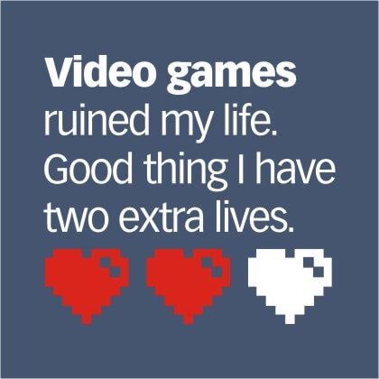

#  פיתוח משחקי מחשב
## קורס באוניברסיטת אריאל, בית-הספר למחשוב, סמסטר א ה'תשפ"ה
----

*שימו לב: הקורס הנוכחי מותאם לסמסטר בן 10 שבועות. אם יהיו 13 שבועות, תוכנית הלימודים תשתנה בהתאם.*

הקורס כולל שני נושאים עיקריים:

* תהליך העיצוב והפיתוח של משחקים ומשחקי-מחשב.
* תיכנות משחקים בשפת סי שארפ ומנוע יוניטי. 

במהלך הקורס תתכננו ותכתבו משחק מחשב מקורי, בדומה ל[משחקים שפיתחו סטודנטים בקורס בשנים קודמות](https://sites.google.com/view/gamedev-at-ariel).

בשיעור האחרון של הקורס, תציגו את המשחק שלכם בפני צוות שופטים מבכירי ה[חברות לפיתוח משחקי מחשב בישראל](israeli-gamedev.md). הזוכים במקומות הראשונים יזכו בתוספת ניקוד לציון הקורס.

למידע נוסף על הקורס:
* [חוקי צבירת הנקודות בקורס](grade-rules.md)
* [תקנון היושר בהגשת מטלות](https://www.ariel.ac.il/wp/cs/wp-content/uploads/sites/88/2020/08/Guidelines-for-Academic-Integrity.pdf)
* [למי הקורס **לא** מתאים](disclaimer.md)
* [דרישות חומרה ותוכנה](hardware.md)
* [דוגמאות קוד להרצאות](../../../)

## מצגות והקלטות

כדי לצפות במצגות, צריך לשבט את כל המאגר למחשב שלכם:

    git clone https://github.com/gamedev-at-ariel/gamedev-5785.git

להיכנס לתיקיה של השבוע המתאים, 
ולפתוח את הקובץ
`slides.html`
בדפדפן כלשהו.

ניתן גם לצפות ב[הקלטות הקורס משנת ה'תשפ"ב](https://www.youtube.com/playlist?list=PLM9fKcsATjxjqsyIcU4IRWuo-w4rQf_Pb).

**שימו לב:** קבצי המטלות שבתיקיות מתעדכנים לאחר השיעור השבועי. אנא אל תתחילו לפתור את המטלות לפני שקיבלתם הודעה בקבוצת הדיוור.

## קישורים שימושיים
* [איפה מוצאים משחקים בחינם](free-games.md)
* [איפה מוצאים נכסים בחינם](free-assets.md)
* [כנסים בינלאומיים שבהם אפשר להציג את המשחקים שלכם](conferences.md)
* [קורסים אחרים בארץ ובעולם](other-courses.md)
* [חברות לפיתוח משחקי מחשב בישראל](israeli-gamedev.md)

## תודות
הקורס פותח בעזרתם של הסטודנטים: מעוז גרוסמן, מיכאל למברגר, אור הדר וגיא אנקרי.

תודה רבה למתרגלי הקורס: מיכאל למברגר וויקטור קושניר.

חלק מחומרי הלימוד נכתבו ע"י חן אוסטרובסקי, אינה גריגור, אביהוא אושרי ואליהו פרץ.

הקלטות הקורס נערכו ע"י יוסף כחלון.

חלק מהחומר על יוניטי נלמד מקורסים ביודמי: [Unity 2D](https://www.udemy.com/course/unitycourse/learn/lecture/10248514),  [Unity 3D](https://www.udemy.com/course/unitycourse2/learn/lecture/8859276),  [Unity RPG](https://www.udemy.com/course/unityrpg/learn/lecture/14593312).

[התמונה למטה מאתר reddit](https://www.reddit.com/r/gaming/comments/84884e/video_games_ruined_my_life/).

